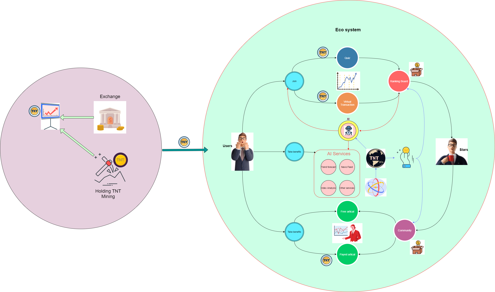

## 4. Ecology

### 4.1 Ecology System

We target to setup an ecology just like the picture above. Customer buy the TokenTrend from exchange, after that he bacome the ToeknTrend holder. We will provide many service to our TokenTrend holder for free, the only thing they need to do is holding the TokenTrend. We can divided our ecology system into 3 parts generally. The first one is **Simulate system**. The second one is **Community system**, the last one is **AI system**. The 3 parts also linked together like above.
#### Simulate System
After he enter our ecology system, he can join the Quiz or Virtual Transaction with their TokenTrend. And there is a ranking system according to the result. With the ranking system we can identify some stars of the coin trader and get some trader's expectation of the market. The identified star will be pushed to **Community system**, and the expectation will be used in our **AI system**.

#### AI System
AI system will collect data from Internet and the data from **Simulate System**. After data analysis we will provide at least 3 kinds of service **Trend Forecast**,**Index Analysis** and **News Feed**. For more technique instruction please refer to Chapter 3 for more detail.

#### Community System
All token holders can write articles about coin trading, but the stars identified by our system will be marked with crown to show his professionalism. The articles can be categorized into 2 kinds, one is public for free and another is payed. And the blogger will get benifit from this part.

### 4.2 Token Allocation

All TokenTrend will be divided for different purpose. 
- Token Sale - 20%: Token for sale.
- Consultant - 5%: Token for consultant.
- Fundation - 10%: 
- Ecological Construction - 10%: 
- Game/Mining Reward - 25%:
- Environmental Protection - 5%:
- Community Building - 5%: 
- Team - 20%: Team salary and cost.

