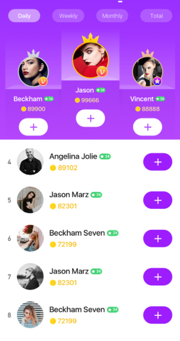
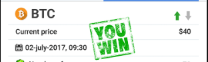
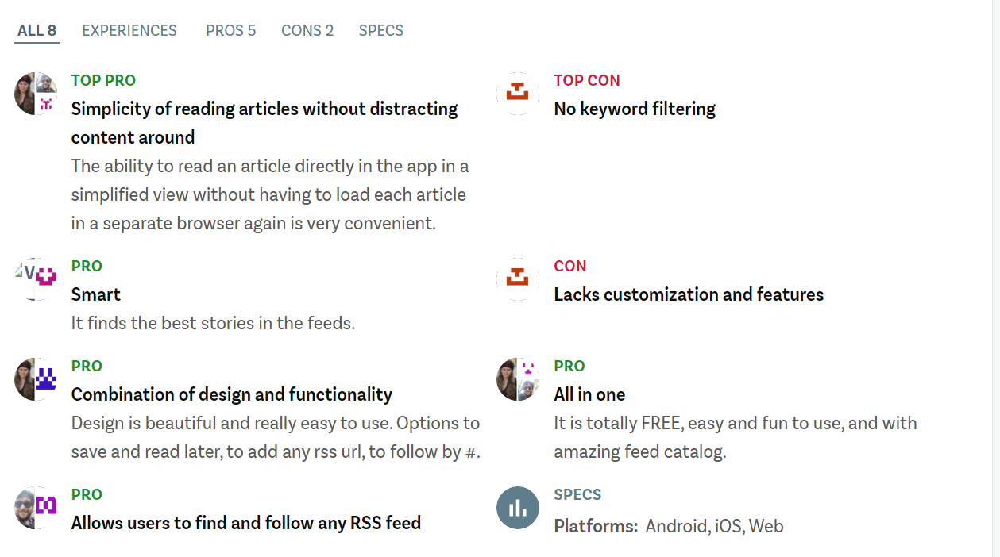

## 6. Functional Modules
We have many different ways to circulate the trillionaire coin online, In addition to being circulated on exchanges, it can also be circulated on our website.
We are building a web platform by an excellent and professional IT development team lead by one software principle and two software expert engineers. There are several excited modules designed on this platform which provide holders a lot of features can be enjoyed and circulate the trillionaire coin.

### Feature1: The entertainment module, including quiz feature, index feature, etc.
We will setup a lot of entertainment features in this module, like the quiz of the trend of real cryptocurrencies. Holders can use their trillionaire coins to have some fun as well as some benefits with these features. There will be a ranking board shows who are the best players in this module, since the trend we get is the real data from exchange, so the rank can show the true level of these top players, that makes their sharing and comments in our community module can guide other holders about the trend of real cryptocurrencies.

We guarantee that there will be absolutely NO fee in this module, that means when holders enjoy here, it is a win-win business model without any extra burden that have to take. 
 

 

### Feature2: The game module, including several different online games such as chess and cards.
We have strong technical support to realize the development and operation of a variety of online games on our platform. Our virtual currency will be used as the circulation currency of this game module. Holders can enjoy the happiness brought by the game and improve the circulation and value of this coin together.
 

### Feature3: The farming module.
Holders can generate LP tokens to add liquidity into cross-chain pool via staking single or multiple tokens. LP tokens represent liquidity providers' right to redeem their assets and earn rewards from trading fees, proportional to their contributions to the cross-chain pool. 100% of the trading fees in cross-chain swap will be distributed to liquidity providers, which means the amount of the underlying token that can be redeemed by each LP token increases. LP tokens will be burned when liquidity providers withdraw their liquidity, and they can get back their deposited token pairs

### Feature4: The online community module.
The main mission of trillionaire coin’s community is to bring together the like-minded people to support each other and environmental protection worldwide. Holders will join the community and share their opinions in terms of cryptocurrency and environmental protection. With the interaction with other two modules, which are Game module and Virtual transaction module, holders can follow top players in these two modules where can show their true professional levels, that may bring a lot of benefits to almost everyone.
 

### Feature5: The virtual transaction.
Most of people in the cryptocurrency world checks the price of the currencies through applications, usually Coin Ticker, Blockfolio or similar. While none of these applications provide accurate information on what to invest, they merely allow to track the market status or your portfolio value.

We also know that almost everyone in the community (whether a crypto trader, a miner, a small investor or a big whale) spends a lot of time, experience, and even luck to look up for investment hints and clues from resources such as blogs, twitter, slack communities, troll boxes and coinmarketcap.com.

For these pain points, we design the virtual market module, holders can operate the cryptocurrencies like what they do in the real exchange in this module, the different is that, the trillionaire coin will be used instead of other kind of cryptocurrencies.

With this excited feature, holders can practice and simulate this transaction here to verify their judgment on the cryptocurrencies with the opportunity to win more of trillionaire coins at the same time. 

There will be a corresponding leaderboard list in this module shows that starts who have won the most coins, they can express their views on the trend in our community module as well, all the holders can take the benefits of their ideas since almost everyone on our website can browser all public sharing like what they do on Twitter or something, the different is that, this community is only built for the currency circle, and everyone has a clear vison of strong players since they can fetch all this information simply through our virtual market’s ranking board.
 