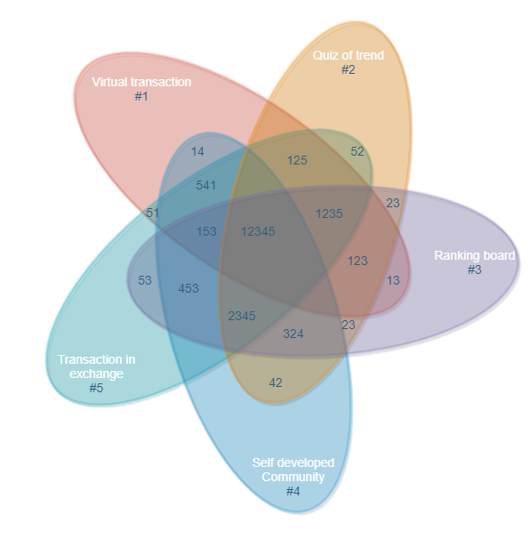

## 2. Introduction
### 2.1 Summary
The birth of the Trillionaire Coin is based on the combination of 3Os Lab’s milestones and the technology of blockchain and as well as the development of cryptocurrency. The mission of trillionaire coin is to provide consumers a cryptocurrency-based sustained and stable growth mainstream virtual currency with a self-developed platform to build the ecosystem to enhance the circulation of this currency. The benefits of this design aim to bring together the like-minded people to support each other’s growth and environmental protection worldwide.

### 2.2 Background
3Os Lab was established in new Zealand in 2018. We have worked on contributing our implementation towards the combination of IT achievements and blockchain technology. We have delivered our IT products to many companies, that led some IT experts in terms of blockchain in 3Os team who becomes the core power of the trillionaire token now. We have continuously accumulated our knowledge regarding blockchain and cryptocurrency and help community to grow up together with us, right now we have served over 20,000 users in over 5 countries worldwide as well as the community of over 30,000 people in new Zealand, Germany, Japan, USA and China.

### 2.3 Mission
**Our mission** is to provide consumers a cryptocurrency-based sustained and stable growth mainstream virtual currency with a self-developed platform to build the ecosystem to enhance the circulation of this currency. Top professional users in this field can be identified in the ranking board, they can share their valuable experience and comments about cryptocurrencies in our community, then all holders can take the benefits of this ecosystem by following these top users in the community. They can refer to these experiences when they are operating real transaction in the Exchange.

