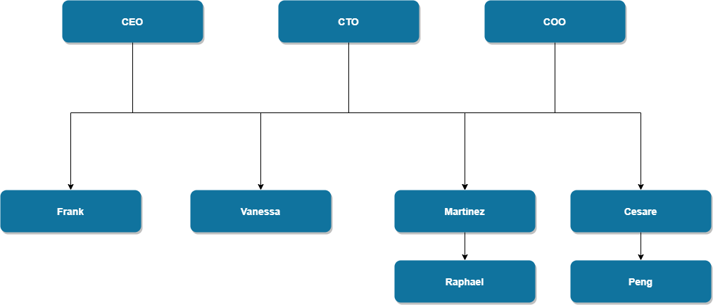

##  7. The team

We have formed a team of highly ambitious blockchain professionals to achieve an important goal — Establish a universal cryptocurrency that can be highly circulated worldwide, and at the same time develop a community that provide somer service like entertainment, discussion and so on, and the currency can be highly circulated on the community.

**CEO Rodriguez**, More than 13 years’ experience of internet development in multiple technical middleware.Proficient in Java, Go and Rust and DevOps Expert.

**CTO Louis**, More than 13 years' experience in research and development of IT industry. ACMer and expert in algorithm. Hold 3 patents and 3 papers which were published in international conferences. Familiar with blockchain and solidity. Gonzalo Core Developer. 

**COO Antonio**, More than 15 year's website operation experience. Expert in Go, solidity and DevOps. Expert with Cloud DevOps covering AWS，Azure and AliCloud. 

**Researcher Frank**, 10 years’ experience in Internet big data analysis. 3 years’ experience in the blockchain industry. Expert in economic modelling and distributed businesses. 

**UI Expert Vanessa**, 10 years’ experience in IT technology development. Many years of experience in UI design. 

**Core developer Martinez**, 11 years’ experience in electronic business software development and management. Smart Contract expert and DaPP developer. Expert in distributed network. 

**Core developer Cesare**, More than 12 years' experience in IT technology development. Full stack developer. Proficient in algorithm, Big data, Java, Python and Golang. Familiar with Ethereum blockchain. 

**Developer Raphael**, Expert in Java language, main programmer for multithreaded programming, real-time and high-performance middleware software. 

**Developer Peng**, Over 15 years’ experience in software development/integration. Developer of Auckland Blockchainlabs (technical team). 

 